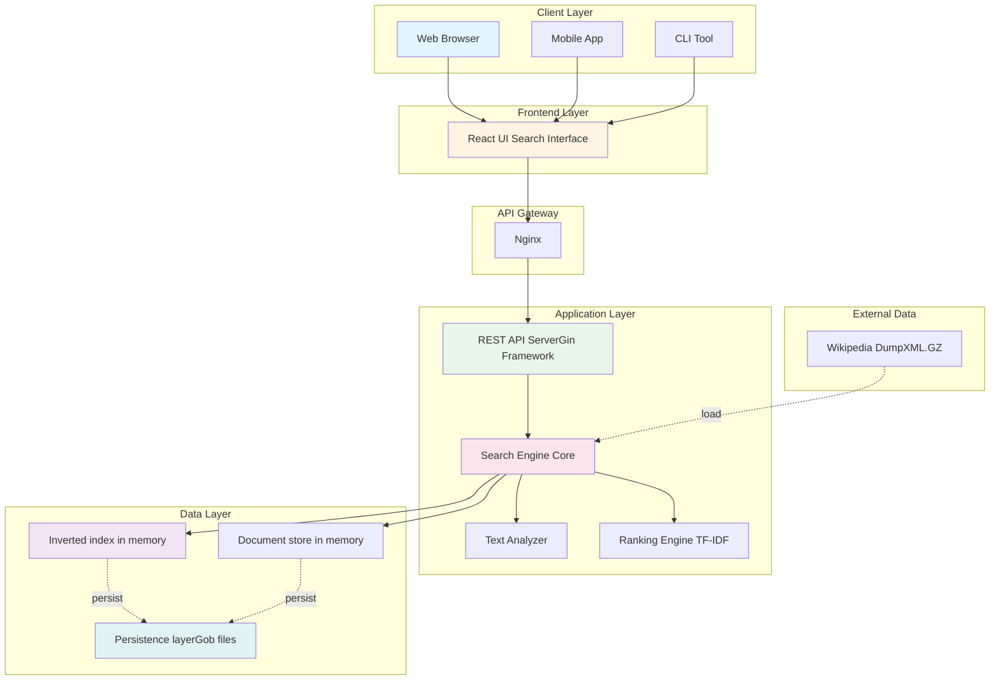
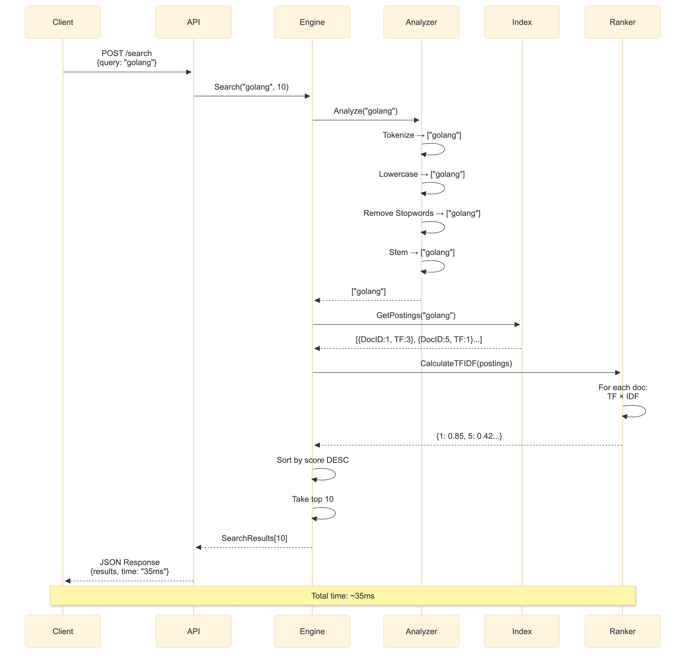
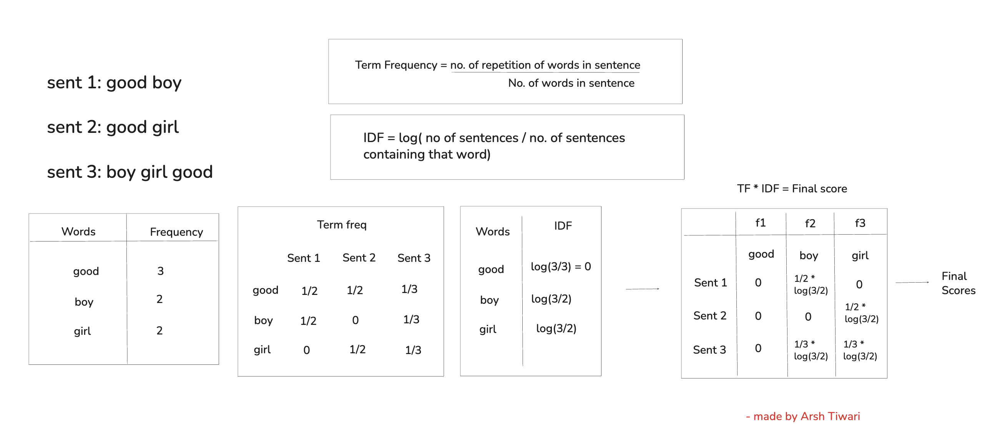

<div align="center">


<br/>
<br/>


</div>

GoSearch is a fast full-text search engine built from scratch in Go. It indexes documents using an inverted index and ranks search results with TF-IDF, providing relevant results in milliseconds. Designed for speed, it supports concurrent indexing, persistent storage for quick startup, and a RESTful API making it an efficient, cost-free alternative to heavier search systems like Elasticsearch for datasets under 10 million documents.


For testing, I used the `simplewiki-latest-pages-articles.xml.bz2` dump file from:
[https://dumps.wikimedia.org/simplewki/latest/](https://dumps.wikimedia.org/simplewiki/latest/).
You can download any Wikipedia dump from there and use it for testing.
If you're using a different dump file, update the default path in `main.go`:
```go
flag.StringVar(&dumpPath, "dump", "simplewiki-latest-pages-articles.xml.bz2",
    "Path to Wikipedia dump file")
```
or pass your own dump file path using the -dump flag when running the program:
```go
go run cmd/main.go -dump pathtoyour-dump-file.xml.bz2
```


## Installation

### Prerequisites
- **Go 1.21+** ([Download](https://golang.org/dl/))
- **Git**
- **4GB+ RAM** (for indexing large documents otherwise it will hang)

### Quick Start

```bash
# Clone the repository
git clone https://github.com/ArshTiwari2004/go-text-search-engine.git
cd gosearch

# Download dependencies
go mod download

# Download Wikipedia dump (optional as you can use your own data)
wget https://dumps.wikimedia.org/simplewiki/latest/simplewiki-latest-pages-articles.xml.bz2

# Build the project
go build -o gosearch ./cmd/api

# Run the server
./gosearch -dump enwiki-latest-abstract1.xml.gz -port 8080
```

Setup the frontend, this is optional
```bash
cd frontend

# Install dependencies
npm install

# Start development server
npm start

# Frontend will open at http://localhost:5173
```

## Usage

### Command Line

```bash
# First run, builds index
./gosearch -dump wiki-dump.xml.gz

# Subsequent runs, it loads from disk
./gosearch

# Force rebuild
./gosearch -rebuild
```

### Programmatic Usage

```go
package main

import (
    "github.com/ArshTiwari2004/gosearch/internal/engine"
)

func main() {
    // Create engine
    eng := engine.NewEngine()
    
    // Load documents
    docs, _ := engine.LoadDocuments("dump.xml.gz")
    
    // Build index
    eng.IndexDocuments(docs)
    
    // Search
    results, _ := eng.Search("golang concurrency", 10)
    
    for _, result := range results {
        fmt.Printf("%s (score: %.3f)\n", result.Document.Title, result.Score)
    }
}
```


Modern applications require search functionality, but existing solutions have limitations:

| Solution | Problem |
|----------|---------|
| **Elasticsearch** | Expensive ($$$), complex setup, overkill for <10M docs |
| **Algolia** | Vendor lock-in, expensive at scale ($2K+/month) |
| **Built-in SQL LIKE** | Doesn't scale beyond 100K records, no relevance ranking |
| **strings.Contains()** | O(n) per search, no ranking, impractical for large datasets |


## Configuration Options

These are the configuration options provided in the code in the main.go file. Will increase these by time.

These are the command-Line flags used :

```bash
./gosearch [options]

Options:
  -dump string
        Path to Wikipedia XML dump file
        (default "enwiki-latest-stub-articles.xml.gz")
  
  -data string
        Directory for index persistence
        (default "./data")
  
  -port string
        HTTP server port
        (default "8080")
  
  -rebuild
        Force rebuild index from dump (ignores persisted index)
        (default false)
```

### Examples

```bash
# Use custom dump file
./gosearch -dump my-documents.xml.gz

# Use different port
./gosearch -port 3000

# Force rebuild (useful after code changes)
./gosearch -rebuild

# All options combined
./gosearch -dump data.xml.gz -port 9000 -data /var/lib/gosearch -rebuild
```


## Features available in Gosearch:

### Core Search Engine
- [x] **Inverted Index** - Maps terms to documents for fast lookups
- [x] **TF-IDF Ranking** - Relevance scoring based on term frequency and inverse document frequency
- [x] **Text Analysis Pipeline**
  - Tokenization (split on word boundaries)
  - Lowercasing (case-insensitive search)
  - Stopword removal (filter common words)
  - Snowball stemming (reduce to root forms)
- [x] **Boolean AND Queries** - Find documents containing all query terms
- [x] **Ranked Results** - Sort by relevance score

### Performance Optimizations
- [x] **Concurrent Indexing** - Worker pool pattern for parallel processing
- [x] **Persistent Storage** - Save/load index to avoid rebuild (85% startup time reduction)
- [x] **Memory Efficiency** - Optimized data structures
- [x] **Posting List Intersection** - Efficient merge algorithm (O(n+m))

### API & Integration
- [x] **RESTful API** - JSON endpoints with Gin framework
- [x] **CORS Support** - Enable frontend integration
- [x] **Statistics Endpoint** - Real-time performance metrics
- [x] **Health Checks** - Monitoring and alerting support
- [x] **Documentation** - OpenAPI/Swagger compatible

### Developer Experience
- [x] **Clean Architecture** - Separation of concerns
- [x] **Comprehensive Comments** - Documented each function cleanly
- [x] **Error Handling** - Proper error propagation
- [x] **Type Safety** - Strongly typed throughout

## High-Level System Architecture
- will update this



While performing testing with `simplewiki-latest-pages-articles.xml.bz2` dump file, the search engine had 1,000 documents( limit set intentionally ) indexed with 52,366 unique terms, when searching for "go programming", the frontend sends a POST request to `/api/v1/search`, and the Go backend performs TF-IDF ranking to return the top results. The query returned 20 results in 1.777208 ms (~1.7 ms), demonstrating very fast processing and low-latency performance.

## API Documentation

### Base URL
```
http://localhost:8080/api/v1
```

### Endpoints

#### 1. Search (POST)
**Endpoint:** `POST /api/v1/search`

**Request:**
```json
{
  "query": "golang concurrency patterns",
  "max_results": 10,
  "min_score": 0.5
}
```

**Response:**
```json
{
  "query": "golang concurrency patterns",
  "results": [
    {
      "document": {
        "id": 12345,
        "title": "Go Concurrency Patterns",
        "url": "https://...",
        "text": "...",
        "word_count": 500
      },
      "score": 8.45,
      "snippets": ["...concurrency patterns in Go..."],
      "rank": 1
    }
  ],
  "total_results": 15,
  "time_taken": "23.5ms",
  "success": true
}
```

#### 2. Search (GET)
**Endpoint:** `GET /api/v1/search?q=golang&limit=10`

**Response:** Same as POST

#### 3. Get Document
**Endpoint:** `GET /api/v1/document/:id`

**Response:**
```json
{
  "document": {
    "id": 12345,
    "title": "Document Title",
    "text": "Full document text...",
    "url": "https://..."
  },
  "success": true
}
```

#### 4. Statistics
**Endpoint:** `GET /api/v1/stats`

**Response:**
```json
{
  "total_documents": 600000,
  "total_terms": 2500000,
  "total_queries": 15234,
  "average_query_time": "45.2ms",
  "memory_usage_mb": 450.3,
  "index_size_kb": 102400,
  "uptime": "5h23m"
}
```

#### 5. Health Check
**Endpoint:** `GET /health`

**Response:**
```json
{
  "status": "healthy",
  "documents": 600000,
  "terms": 2500000,
  "queries": 15234,
  "timestamp": 1640000000
}
```


## Concurrent Indexing Flow

Concurrent indexing uses a worker pool pattern where N workers (based on CPU cores) process documents in parallel, build local indices without locks, then merge at the end for a 1.9x speedup.

A worker pool is a concurrency pattern where:
- we create N worker goroutines
- send them tasks through a channel
- each worker picks up tasks and processes them
- wait until all workers finish
Instead of doing work one by one, we divide it across multiple workers running in parallel.

In my code this "task" is the documents to index.

```go
// Create worker pool
workers := runtime.NumCPU()
docsChan := make(chan Document, workers)

// Start workers
for i := 0; i < workers; i++ {
    go func() {
        for doc := range docsChan {
            index.AddDocument(doc)  // Process in parallel
        }
    }()
}

// Send work
for _, doc := range documents {
    docsChan <- doc
}
```

### Concurrency Model

I have used two types of concurrency:

#### 1. Worker Pool fo parallel indexing

Indexing uses a **worker pool pattern** to process documents concurrently.

```go
for i := 0; i < numWorkers; i++ {
    wg.Add(1)
    go func() {
        defer wg.Done()
        for doc := range docsChan {
            e.index.AddDocument(doc)
        }
    }()
}
```
It works in this way:
Starts numWorkers goroutines
Each worker:
-> Waits for documents from docsChan
-> Calls AddDocument(doc)
-> Runs until the channel is closed

Documents are distributed using:
```go
for _, doc := range docs {
    docsChan <- doc
}
close(docsChan)
```
The main goroutine waits for completion:
```go
wg.Wait()
```
Why I used worker pool in this project:
Indexing is CPU-intensive,
Each document is independent,
Utilizes multiple CPU cores efficiently,
Prevents spawning unlimited goroutines.


#### 2. Mutex for thread safety

The engine uses sync.RWMutex to prevent race conditions.
```go
e.mu.Lock() → Used during indexing (write operation)
e.mu.RLock() → Used during search (read operation)
```
This ensures that
-> safe concurrent searches
-> no modification of the index while indexing is running.


## Search query flow:

The query is processed through the Analyzer (tokenization, normalization, stemming), relevant postings are retrieved from the inverted index, TF-IDF scores are computed for matching documents, results are ranked in descending order, and the top-k documents are returned as a structured JSON response.





## TF-IDF Ranking Algorithm

GoSearch uses the **TF-IDF (Term Frequency - Inverse Document Frequency)** model for keyword-based relevance ranking.

```go
type Posting struct {
    DocID         int
    TermFrequency int  // Used for TF
    DocLength     int  // Used for normalization
}
```

### Term Frequency (TF)
Measures how often a term appears in a document.  
Higher frequency ⇒ higher importance within that document.

### Inverse Document Frequency (IDF)
Measures how rare a term is across the corpus.  
Rare terms receive higher weight, while common terms (e.g., stop words) receive lower weight.

Scoring Formula goes as:

score(term, document) = TF × IDF

The key insights were:

- Terms appearing in all documents receive very low (or zero) IDF weight.
- Rare, discriminative terms contribute more to ranking.
- Documents containing more query-specific terms rank higher.

In the example below (3 small documents), the word **"good"** appears in all documents and therefore gets minimal ranking weight, while **"boy"** and **"girl"** provide stronger ranking signals.




---

Thanks for reading till here! I’ll continue updating this README with more technical details and deployment steps soon.

