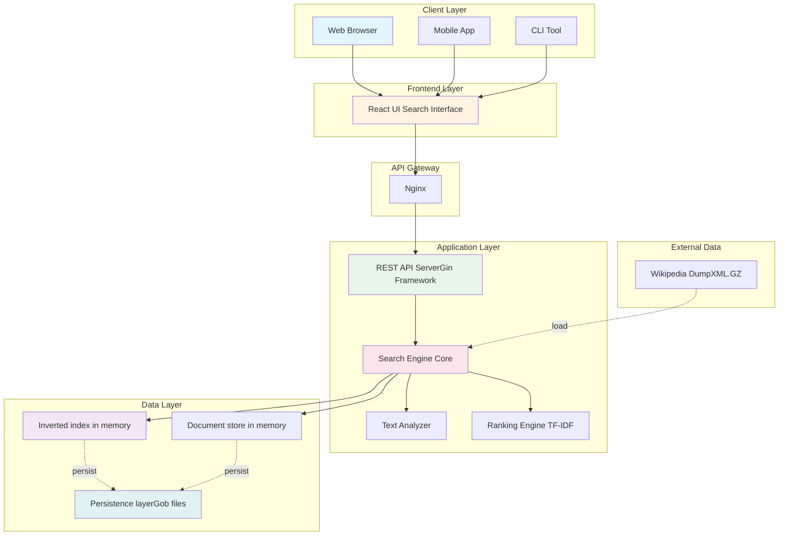
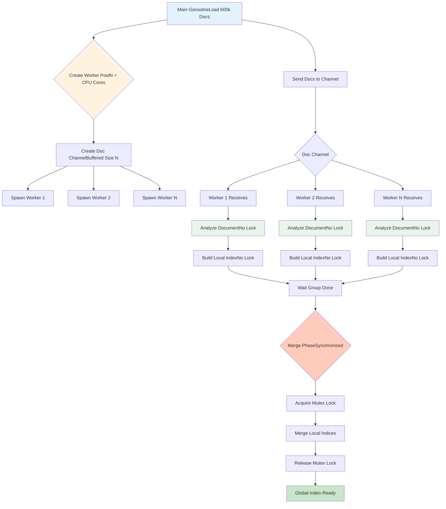

<div align="center">
  
# GOSEARCH


</div>

GoSearch is a fast full-text search engine built from scratch in Go. It indexes documents using an inverted index and ranks search results with TF-IDF, providing relevant results in milliseconds. Designed for speed, it supports concurrent indexing, persistent storage for quick startup, and a RESTful API making it an efficient, cost-free alternative to heavier search systems like Elasticsearch for datasets under 10 million documents.


For testing, I used the `simplewiki-latest-pages-articles.xml.bz2` dump file from:
[https://dumps.wikimedia.org/simplewki/latest/](https://dumps.wikimedia.org/simplewiki/latest/).
You can download any Wikipedia dump from there and use it for testing.
If you're using a different dump file, update the default path in `main.go`:
```go
flag.StringVar(&dumpPath, "dump", "simplewiki-latest-pages-articles.xml.bz2",
    "Path to Wikipedia dump file")
```
or pass your own dump file path using the -dump flag when running the program:
```go
go run cmd/main.go -dump pathtoyour-dump-file.xml.bz2
```


## Installation

### Prerequisites
- **Go 1.21+** ([Download](https://golang.org/dl/))
- **Git**
- **4GB+ RAM** (for indexing large documents otherwise it will hang)

### Quick Start

```bash
# Clone the repository
git clone https://github.com/ArshTiwari2004/go-text-search-engine.git
cd gosearch

# Download dependencies
go mod download

# Download Wikipedia dump (optional as you can use your own data)
wget https://dumps.wikimedia.org/simplewiki/latest/simplewiki-latest-pages-articles.xml.bz2

# Build the project
go build -o gosearch ./cmd/api

# Run the server
./gosearch -dump enwiki-latest-abstract1.xml.gz -port 8080
```


## Usage

### Command Line

```bash
# First run, builds index
./gosearch -dump wiki-dump.xml.gz

# Subsequent runs, it loads from disk
./gosearch

# Force rebuild
./gosearch -rebuild
```

### Programmatic Usage

```go
package main

import (
    "github.com/ArshTiwari2004/gosearch/internal/engine"
)

func main() {
    // Create engine
    eng := engine.NewEngine()
    
    // Load documents
    docs, _ := engine.LoadDocuments("dump.xml.gz")
    
    // Build index
    eng.IndexDocuments(docs)
    
    // Search
    results, _ := eng.Search("golang concurrency", 10)
    
    for _, result := range results {
        fmt.Printf("%s (score: %.3f)\n", result.Document.Title, result.Score)
    }
}
```


Modern applications require search functionality, but existing solutions have limitations:

| Solution | Problem |
|----------|---------|
| **Elasticsearch** | Expensive ($$$), complex setup, overkill for <10M docs |
| **Algolia** | Vendor lock-in, expensive at scale ($2K+/month) |
| **Built-in SQL LIKE** | Doesn't scale beyond 100K records, no relevance ranking |
| **strings.Contains()** | O(n) per search, no ranking, impractical for large datasets |


## Features available in Gosearch:

### Core Search Engine
- [x] **Inverted Index** - Maps terms to documents for fast lookups
- [x] **TF-IDF Ranking** - Relevance scoring based on term frequency and inverse document frequency
- [x] **Text Analysis Pipeline**
  - Tokenization (split on word boundaries)
  - Lowercasing (case-insensitive search)
  - Stopword removal (filter common words)
  - Snowball stemming (reduce to root forms)
- [x] **Boolean AND Queries** - Find documents containing all query terms
- [x] **Ranked Results** - Sort by relevance score

### Performance Optimizations
- [x] **Concurrent Indexing** - Worker pool pattern for parallel processing
- [x] **Persistent Storage** - Save/load index to avoid rebuild (85% startup time reduction)
- [x] **Memory Efficiency** - Optimized data structures
- [x] **Posting List Intersection** - Efficient merge algorithm (O(n+m))

### API & Integration
- [x] **RESTful API** - JSON endpoints with Gin framework
- [x] **CORS Support** - Enable frontend integration
- [x] **Statistics Endpoint** - Real-time performance metrics
- [x] **Health Checks** - Monitoring and alerting support
- [x] **Documentation** - OpenAPI/Swagger compatible

### Developer Experience
- [x] **Clean Architecture** - Separation of concerns
- [x] **Comprehensive Comments** - Documented each function cleanly
- [x] **Error Handling** - Proper error propagation
- [x] **Type Safety** - Strongly typed throughout

## High-Level System Architecture
- will update this



While performing testing with `simplewiki-latest-pages-articles.xml.bz2` dump file, the search engine had 1,000 documents( limit set intentionally ) indexed with 52,366 unique terms, when searching for "go programming", the frontend sends a POST request to `/api/v1/search`, and the Go backend performs TF-IDF ranking to return the top results. The query returned 20 results in 1.777208 ms (~1.7 ms), demonstrating very fast processing and low-latency performance.

## API Documentation

### Base URL
```
http://localhost:8080/api/v1
```

### Endpoints

#### 1. Search (POST)
**Endpoint:** `POST /api/v1/search`

**Request:**
```json
{
  "query": "golang concurrency patterns",
  "max_results": 10,
  "min_score": 0.5
}
```

**Response:**
```json
{
  "query": "golang concurrency patterns",
  "results": [
    {
      "document": {
        "id": 12345,
        "title": "Go Concurrency Patterns",
        "url": "https://...",
        "text": "...",
        "word_count": 500
      },
      "score": 8.45,
      "snippets": ["...concurrency patterns in Go..."],
      "rank": 1
    }
  ],
  "total_results": 15,
  "time_taken": "23.5ms",
  "success": true
}
```

#### 2. Search (GET)
**Endpoint:** `GET /api/v1/search?q=golang&limit=10`

**Response:** Same as POST

#### 3. Get Document
**Endpoint:** `GET /api/v1/document/:id`

**Response:**
```json
{
  "document": {
    "id": 12345,
    "title": "Document Title",
    "text": "Full document text...",
    "url": "https://..."
  },
  "success": true
}
```

#### 4. Statistics
**Endpoint:** `GET /api/v1/stats`

**Response:**
```json
{
  "total_documents": 600000,
  "total_terms": 2500000,
  "total_queries": 15234,
  "average_query_time": "45.2ms",
  "memory_usage_mb": 450.3,
  "index_size_kb": 102400,
  "uptime": "5h23m"
}
```

#### 5. Health Check
**Endpoint:** `GET /health`

**Response:**
```json
{
  "status": "healthy",
  "documents": 600000,
  "terms": 2500000,
  "queries": 15234,
  "timestamp": 1640000000
}
```

## Concurrent Indexing Flow



